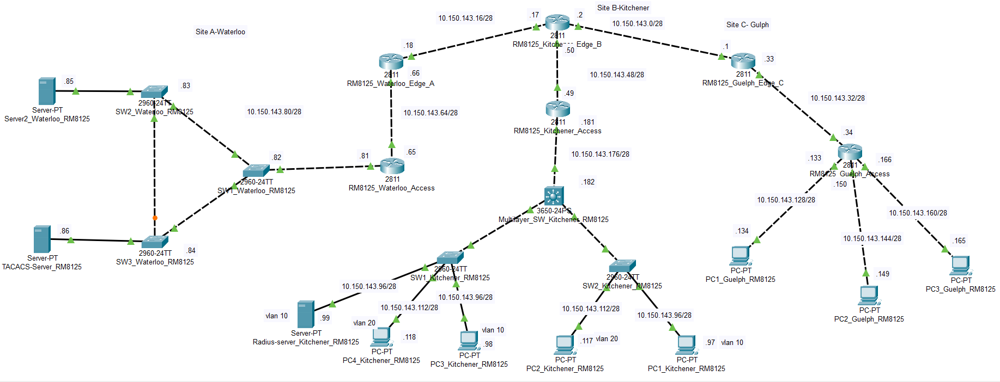
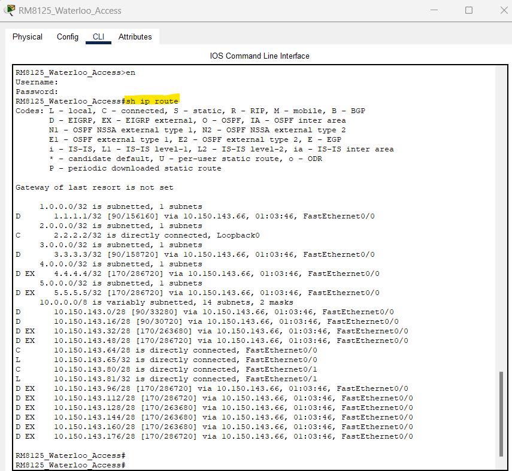
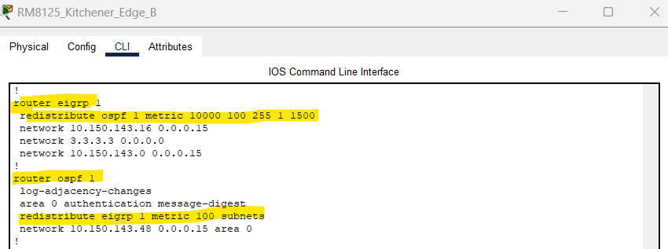
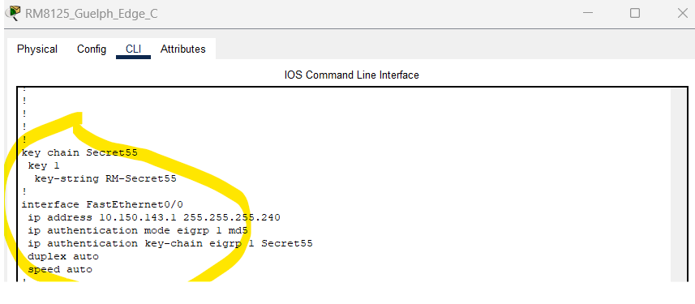
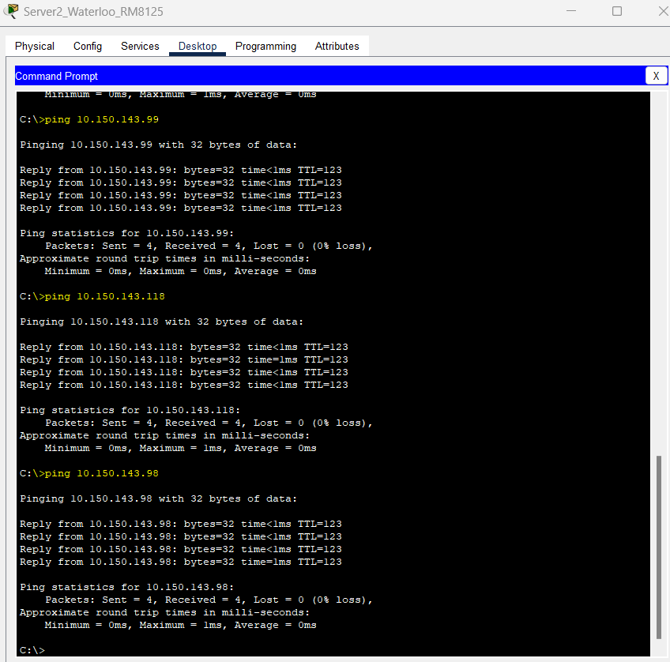

# Multi-Site Network Design
 
A 3-site enterprise network built and tested in Cisco Packet Tracer, covering multi-protocol routing, VLAN segmentation, Spanning Tree analysis, and centralized authentication (TACACS+ / RADIUS).

 ## Overview
 
This project designs and implements a secure, multi-site network connecting three locations — **Waterloo**, **Kitchener**, and **Guelph** — with each site intentionally running a different routing protocol (EIGRP, OSPF, RIP), then redistributing between them so the network functions as one cohesive system. Rather than a single-protocol lab, the scenario simulates a more realistic constraint: sites that were built or acquired independently, on different protocols, that now need to interoperate securely without a network-wide redesign.
 
**Topology at a glance:**
- 3 sites, each with its own access router + edge router
- 6 Cisco 2811 routers, 5 Cisco 2960 (L2) switches, 1 Cisco 3650 (L3) switch
- 7 PCs, 3 servers (TACACS+, RADIUS, web server)
- Assigned subnet: `10.150.143.0`, segmented in `/28` blocks per site

## Design Rationale
 
I deliberately gave each site a different routing protocol instead of running one protocol everywhere — partly to practice redistribution, but mostly because it mirrors a realistic scenario: three sites that were likely built at different times, on different protocols, that now need to talk to each other without a full network-wide redesign.
 
- **EIGRP at Site A** — this became the "backbone" protocol the other two sites redistribute into. EIGRP's composite metric (bandwidth + delay) gives more control over path selection than RIP, and it converges faster than OSPF for a topology this size.
- **OSPF at Site B** — Site B is where inter-VLAN routing happens on a Layer 3 switch, and OSPF's area-based structure fit that switch-to-router boundary better than the alternatives.
- **RIP at Site C** — Site C is the simplest and flattest site (three directly-attached subnets), so RIP's low configuration overhead made sense here — the 15-hop limit was never going to be a real constraint at this scale.
- **Redistribution at the edge routers, not the access routers** — keeping the redistribution point as close to the network boundary as possible, so a routing issue in one protocol domain doesn't leak deeper into another site.
MD5 auth on EIGRP and authenticated OSPF were added on top of this to stop a rogue device from injecting fake routes — a separate concern from the routing logic itself, but one that felt worth including rather than leaving out.
 
## Key Concepts Demonstrated
 
| Area | What was implemented |
|---|---|
| **Routing** | EIGRP (Site A), OSPF (Site B), RIP (Site C) — with mutual redistribution between edge routers |
| **Routing Security** | MD5 authentication on EIGRP updates; authenticated OSPF |
| **AAA / Remote Access** | TACACS+ (Site A) and RADIUS (Site B) authenticating SSH logins to routers |
| **Device Hardening** | SSH-only remote access, encrypted passwords, privileged-mode passwords, forced console login, MOTD banners |
| **Layer 2** | VLANs + trunking + inter-VLAN routing on a Layer 3 switch (Site B) |
| **Spanning Tree (STP)** | Root bridge election, root/designated/blocking port identification, port cost analysis (Site A) |
| **Verification** | End-to-end ping testing across all three sites, from every VLAN and subnet |

## Site Breakdown
 
### Site A — Waterloo
- **Routing:** EIGRP with MD5 authentication between access and edge router
- **AAA:** SSH login to both routers authenticated via TACACS+
- **Services:** Web server with a custom home page, reachable network-wide
- **L2:** 3 switches in a loop-free ring; full STP role/cost analysis performed to confirm no loops
  

 
 
### Site B — Kitchener
- **Routing:** OSPF (authenticated) between access router, edge router, and L3 switch; edge router redistributes EIGRP ⇄ OSPF to link back to Site A
- **AAA:** SSH login to both routers authenticated via RADIUS
- **L2/L3:** Two VLANs (10 & 20) across two access switches, trunked into a Layer 3 switch performing inter-VLAN routing
- **Verified:** cross-VLAN and cross-switch communication, plus full-network reachability from both VLANs
  

 
 
### Site C — Guelph
- **Routing:** RIP between access and edge router; edge router redistributes EIGRP ⇄ RIP to link back to Site A
- **Topology:** 3 PCs directly attached to the access router, each on its own subnet
- **Extra:** Custom domain name (`Rmaster8125.com`) resolving to the Site A web server, accessed cross-site from a Site C PC via DNS

## End-to-End Verification
 
Every device — across all three sites, all VLANs, and all subnets — was tested for full-mesh reachability.
 

 
Screenshots of ping tests from representative devices in each site are included under `screenshots/`.
 
